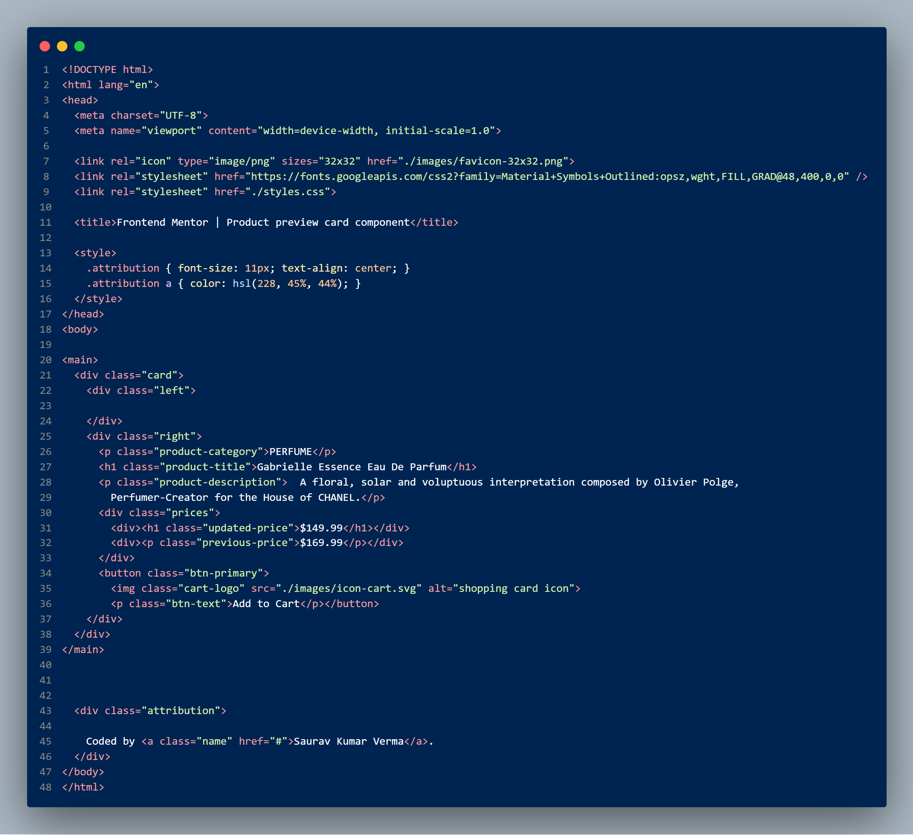
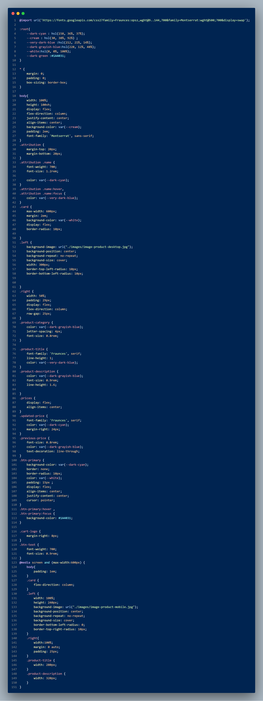

This is a solution to the Product preview card component challenge on Frontend Mentor

Please checkout the project and help me with your valueable feedback.

### Screenshot

Solution ScreenShot

Code ScreenShot - 

### Links

- Live Site URL: https://saurav-98-product-preview-card-component.netlify.app/
  --Github Repo - https://github.com/Saurav-98/Product-preview-card-component

## My process

### Built with

- Semantic HTML5 markup
- CSS custom properties
- Flexbox
- Desktop-first workflow
- Media Queries
  -- CSS Variables

### What I learned

I learned Css special properties to style elements, along with the flexbox workflow with deepdive in making design responsive using flexbox and media queries.

### Continued development

I would like to build the design layout using Grid layout as well and making the layout responsive using grid template area property.

## Author

- Frontend Mentor - [@SauravKumarVerma](https://www.frontendmentor.io/profile/Saurav-98)
- Twitter - [@SauravKverma22](https://twitter.com/SauravKverma22)
- Linkedin - [Saurav Kumar Verma](https://www.linkedin.com/in/saurav-kumar-verma/)
